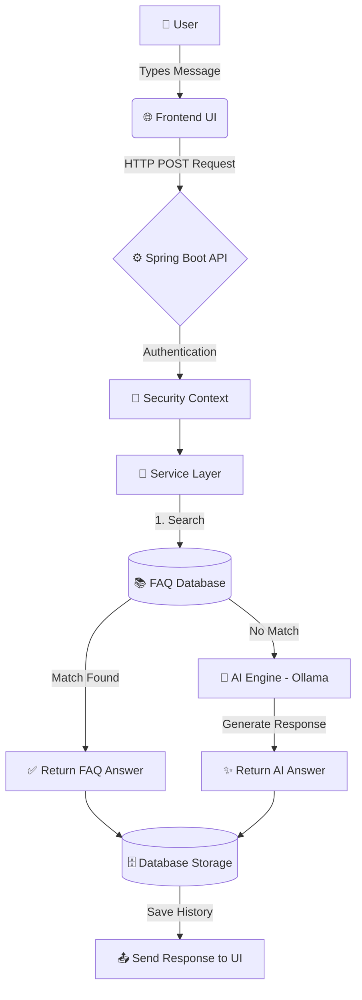

<div align="center">
  
  <h1>🚀 AI Support Assistant (Hybrid Chatbot System)</h1>
  <p><b>A production-ready AI chatbot combining structured knowledge (FAQ) with generative AI for reliable, scalable customer support.</b></p>
  
  <h3>🌐 <a href="https://ai-support-assistant-xm4t.onrender.com">Live Demo</a></h3>

  <p>
    
    
    
    
    
  </p>
</div>

---

## 📌 Overview

This project is a modern, AI-powered customer support chatbot designed to solve real-world limitations. Traditional chatbots are often too rigid (only FAQs) or completely unconstrained (pure AI leading to hallucinations). 

**Our Hybrid Intelligence Model solves this by:**
1. ⚡ **FAQ-First Approach**: Delivering instantaneous and accurate answers for common queries.
2. 🤖 **AI Fallback**: Using **Ollama (TinyLlama)** to intelligently handle unknown queries.
3. 🎯 **Controlled Output**: Preventing hallucination while maintaining conversational flow.

---

## ✨ Key Features

- **Modern Glassmorphism UI**: Beautiful, premium dark/light mode interface with sleek toast notifications and dynamic chat bubbles.
- **Intelligent Response Engine**: Seamlessly switches between database FAQs and LLM responses.
- **Session-Based Architecture**: Maintains persistent, switchable conversation histories just like ChatGPT.
- **PDF Export System**: Allows users to download a clean, formatted transcript of their support sessions.
- **Secure Authentication**: Built-in user registration and login system with JWT/Session management.
- **Plug-and-Play Database**: Currently uses a lightning-fast **H2 In-Memory Database** for instant zero-configuration setup, fully compatible with **PostgreSQL** for production.

---

## 🔄 System Workflow & Architecture



### 🔍 Request Lifecycle
1. **Input**: User submits a query via the chat interface.
2. **Sanitization**: The input is normalized and cleaned.
3. **Primary Verification**: The system checks the internal database for predefined FAQ matches.
4. **Instant Match**: If a match is found, the verified response is returned instantly.
5. **AI Inference**: If no match is found, the prompt is securely forwarded to the local AI model (TinyLlama).
6. **Persistence**: The final response (FAQ or AI) is logged into the database under the active session.
7. **Delivery**: The UI renders the response with a smooth typing animation.

---

## 🚀 Installation & Setup

Get the chatbot running on your local machine in under 2 minutes.

### 1️⃣ Clone the Repository
```bash
git clone https://github.com/chitranjan-patel/ai-support-assistant.git
cd ai-support-assistant
```

### 2️⃣ Start the Local AI Model
Ensure you have [Ollama](https://ollama.com/) installed on your machine.
```bash
ollama run tinyllama
```

### 3️⃣ Run the Backend Server
The project is pre-configured with an **H2 In-Memory Database**, meaning no external database installation is required for testing!
```bash
# Simply run the provided batch script
run.bat

# Or run via Maven directly:
# mvn spring-boot:run
```

### 4️⃣ Launch the Application
Open your favorite web browser and navigate to:
```text
http://localhost:8080/index.html
```

*(Note: To view the H2 Database console, visit `http://localhost:8080/h2-console` with JDBC URL `jdbc:h2:mem:chatbotdb`, user `sa`, and password `password`.)*

---

## 📂 Database Schema

### `users`
| Field | Type | Description |
|-------|------|-------------|
| `id` | PK | Unique identifier |
| `username` | String | User's registered email/name |
| `password` | String | Encrypted password |

### `chat_message`
| Field | Type | Description |
|-------|------|-------------|
| `id` | PK | Unique identifier |
| `username` | String | Associated user |
| `session_id` | String | Specific chat session ID |
| `user_message` | String | The query inputted |
| `bot_reply` | String | The response provided |

---

## 📈 Future Roadmap

- [ ] **Semantic Search Integration**: Upgrading FAQ matching to use vector embeddings.
- [x] **Cloud Deployment Ready**: Dockerized and deployed on Render.
- [ ] **Voice Assistant**: Web Speech API integration for accessibility.
- [ ] **Admin Dashboard**: Analytics portal to track AI accuracy and user satisfaction.

---

<div align="center">
  <b>Developed by Chitranjan Patel</b><br>
  <i>"Not just an AI chatbot — a production-ready intelligent support system."</i>
</div>
